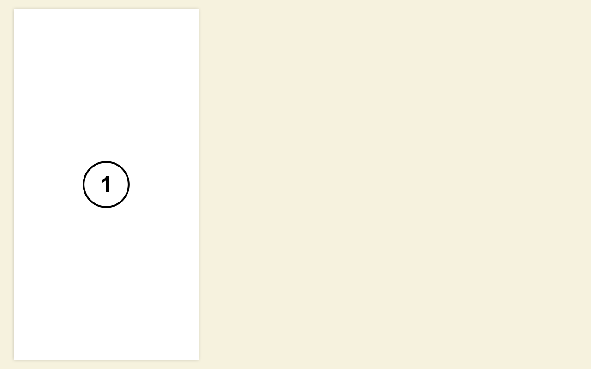

# Тестовое задание

## Описание

Разрабатывается новая версия 2ГИС. Было принято решение располагать весь контент на карточках.

Карточки рамещаются «колодой» друг над другом. Каждая следующая карточка располагается выше предыдущей. Последняя (верхняя) карточка, если она не единственная, сдвигается относительно «колоды» по оси x на 60 пикселей. Карточки занимают всю доступную высоту экрана.


Если карточка единственная, то она располгается без отступа.



Карточки бывают двух видов: узкие и широкие.

* Узкие карточки всегда занимают ширину 400 пикселей;
* Широкие карточки в «колоде» занимают 400 пикселей, если широкая карточка находится наверху колоды, то она занимает всю доступную ширину, но не больше 960 пикселей.


На фоне планируется разместить карту. Пока, при наведении на всё пространство, не занятое карточками, цвет фона должен меняться на `#e9e6d3`.

На карточке отображается её порядковый номер.


## Формат

Карточки описываются массивом такого вида:

```js
var cards = [
    {
        type: 'narrow'
    },
    {
        type: 'wide'
    }
];
```

Параметр `type` для каждого элемента отвечает за то, какого типа карточку выводить — узкую (narrow) или широкую (wide).

## Задание

1. Подключить на страницу файл `cards.js` со стартовым набором карточек;
2. Вывести карточки, описанные в файле на странице согласно дизайну;
    * В качестве шаблонизатора предпочтительно использовать `handlebarsjs`;
    * в процессе проверки файл `cards.js` может быть заменен на любой другой валидный файл, соответствующий формату;
    * карточек может быть произвольное количество.
3. `Click` по карточкам должен удалять последнюю карточку. `Shift+Click` — добавлять новую карточку сверху типа `narrow`, `Shift+Alt+Click` — добавлять новую карточку сверху типа `wide`;
4. Задание со звездочкой: поддерживать переходы по истории браузера. Например, с помощью `Shift+Click` была добавлена новая карточка, кнопка «Назад» в браузере, должна вернуть страницу на шаг назад, то есть удалить последнюю карточку.

> В работе можно использовать сторонние библиотеки.

## Файлы

* [PSD-исходник](source/page.psd);
* [страница в разных состояниях](images/);
* [примеры тестовых данных](data/).
